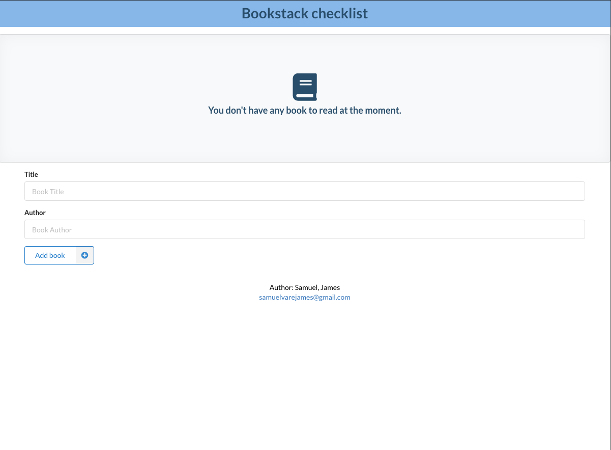
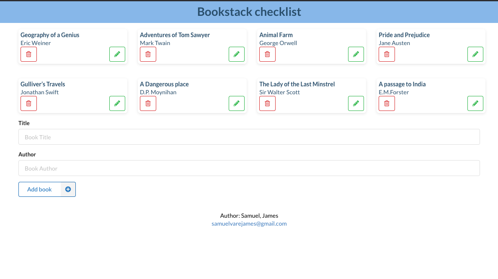
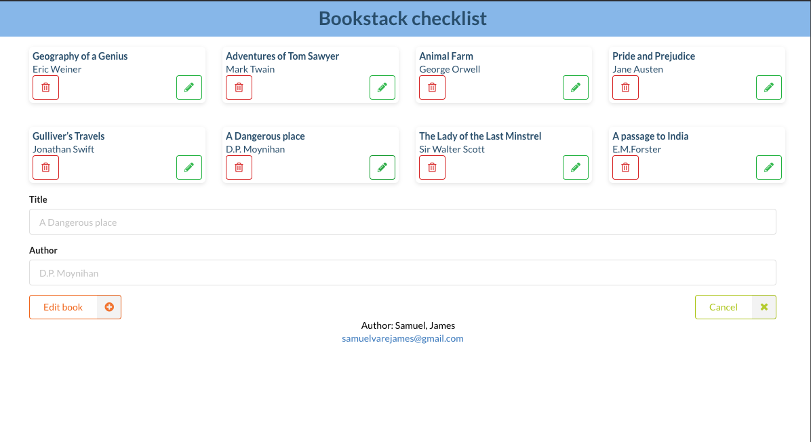

# Bookstack

A simple PWA to demonstrate a CRUD operation for creating book using React Hooks &amp; Context.

Run the command below to start application locally.

```shell
yarn start
```

Sample pix of what app looks like.

## Sample pix of what app looks like








This project was bootstrapped with [Create React App](https://github.com/facebook/create-react-app).
[README REFERENCE](bstack/README.md)
